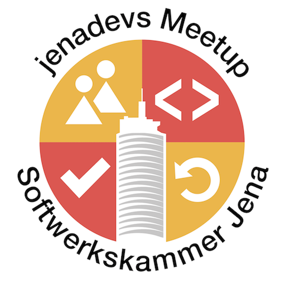
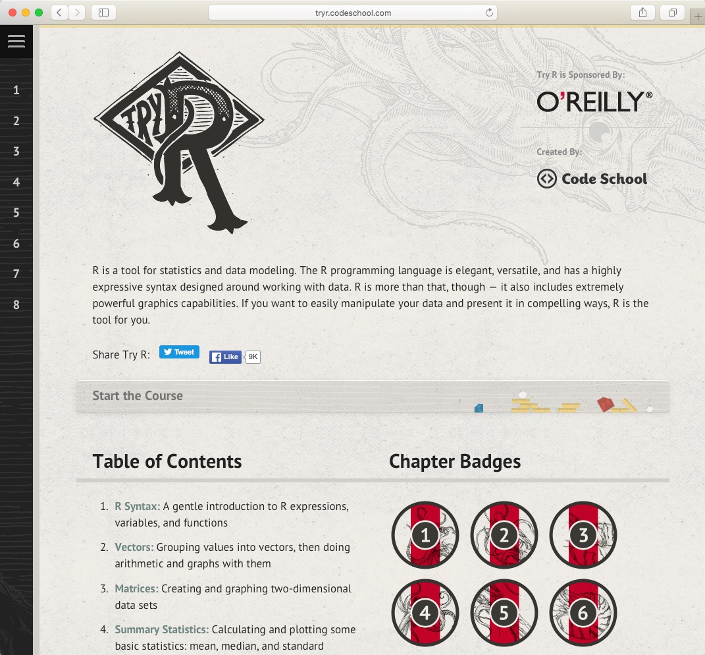

## Jenathon - Open Data Track

> Kick-Off - Technical Ideas

<!--s-->

## Project R

<!--v-->

<!--s-->

## Ruby on Rails Prototype

<!--v-->

### Technical Dependencies

- https://github.com/agrohmann/jenathon
- https://hub.docker.com/r/agrohmann/ruby_nodejs/

- http://rubygems.org/gems/geocoder
- https://rubygems.org/gems/rails_admin

<!--v-->

# Demo

<!--s-->

# Let's start!
