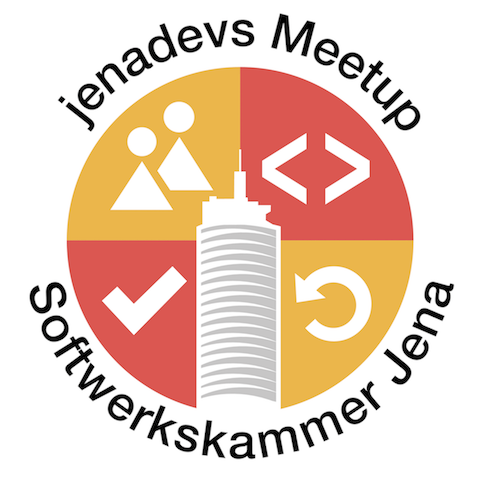
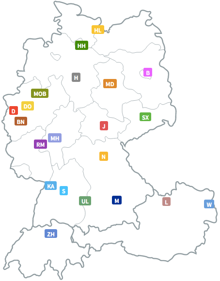
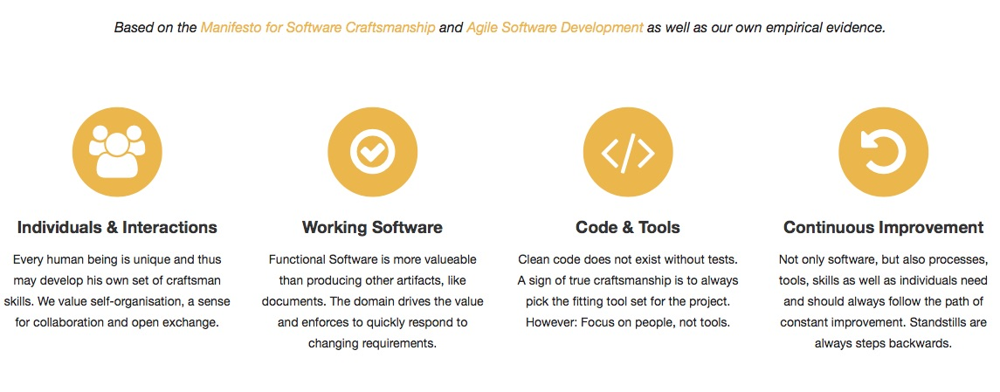
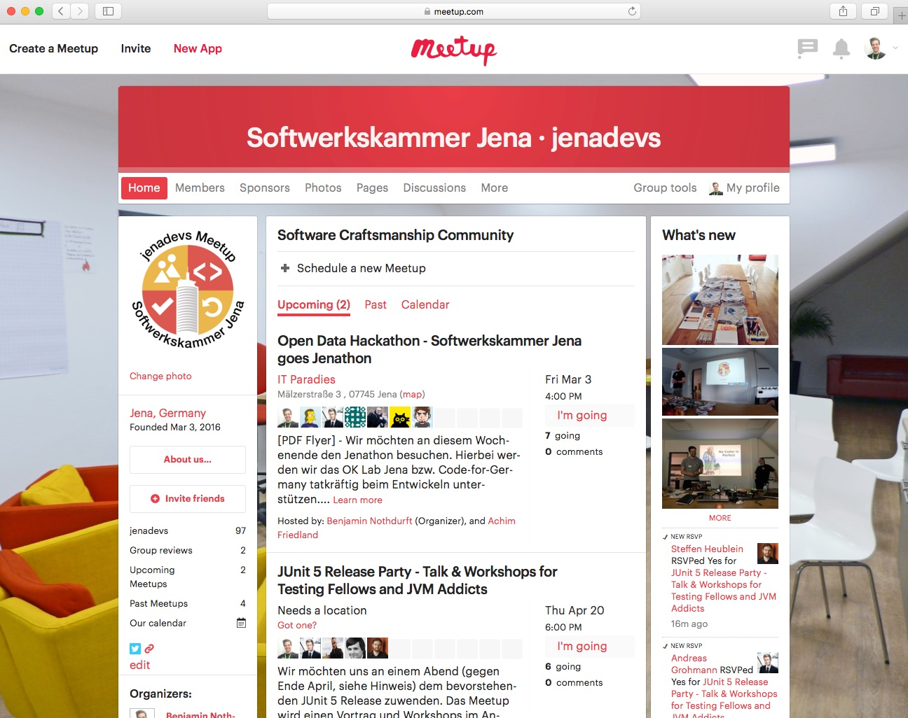
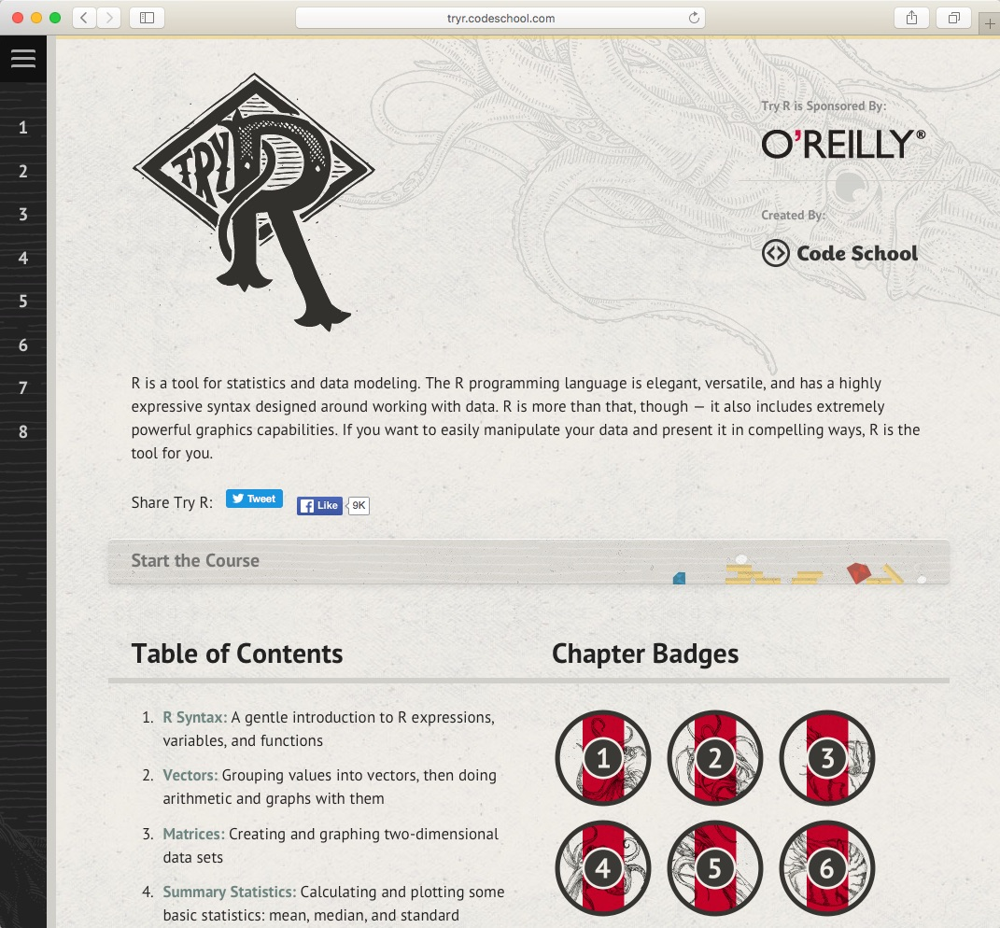
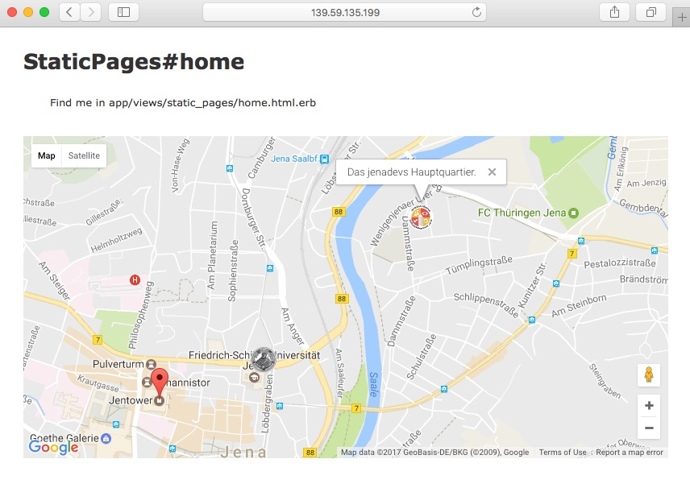

## Jenathon - Open Data Track

> Kick-Off - Technical Ideas

<!--s-->

## Who are we?

<!--v-->

__Software Craftsmanship Community__

<!--v-->

__Values at [www.jenadevs.org](http://www.jenadevs.org)__

<!--v-->

__Register at [www.meetup.com/jenadevs](https://www.meetup.com/jenadevs/)__

<!--s-->

## [Project R](https://www.r-project.org)

- open source programming language
- environment for statistical computing and graphics

<!--v-->

<!--s-->

## Ruby on Rails Prototype

<!--v-->

### Technical Dependencies

- https://github.com/agrohmann/jenathon
- https://hub.docker.com/r/agrohmann/ruby_nodejs/

- http://rubygems.org/gems/geocoder
- https://rubygems.org/gems/rails_admin

<!--v-->

# Demo

<!--s-->

# Let's start!
